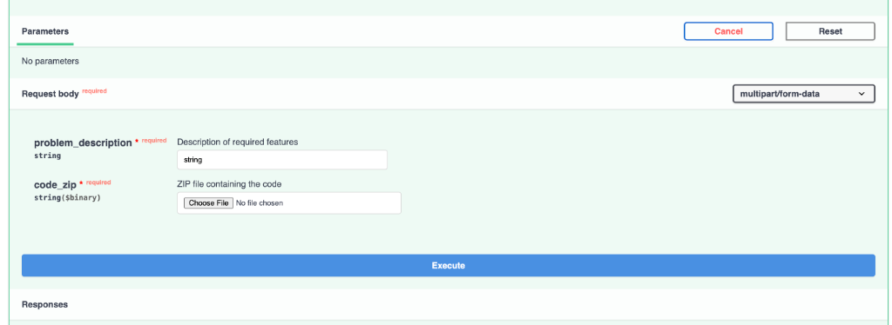
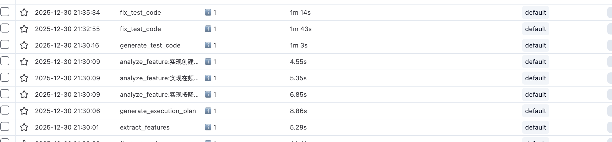

# Code Analyze - AI-Powered Code Review Agent

<div align="center">

**基于 RAG 和 LLM 的智能代码分析系统，实现从需求到功能定位的自动化验证**

[](https://python.org)
[](https://fastapi.tiangolo.com)
[](https://docker.com)

</div>

---

## 🎯 项目亮点

| 技术特性 | 实现方案 | 解决的问题 |
|---------|---------|-----------|
| **RAG 语义检索** | Qdrant 向量数据库 + Embedding | 精准定位相关代码片段 |
| **Tree-sitter 解析** | 多语言 AST 抽象语法树 | 结构化代码理解，非正则匹配 |
| **异步并行处理** | asyncio.gather 批量分析 | 多特性并发分析，显著提速 |
| **ReAct 自修复循环** | LLM 生成 → 执行 → 诊断 → 修复 | 测试失败自动修复，提升成功率 |
| **Docker-in-Docker** | 隔离沙箱测试环境 | 安全执行用户代码，无污染主机 |
| **智能缓存策略** | Redis + 内容哈希 | 重复请求秒级响应 |

---

## � Part 1: Docker Compose 部署

### 1.1 环境准备

```bash
# 克隆项目
git clone <repo-url>
cd code-analyze

# 配置环境变量
cp .env.example .env
```

编辑 `.env` 文件：

```bash
# 必填：LLM API 配置（支持 OpenAI 兼容接口）
LLM_API_URL=https://openrouter.ai/api/v1
LLM_API_KEY=sk-or-your-api-key
LLM_MODEL=openai/gpt-4o-mini

# 可选：Embedding 配置
EMBEDDING_API_URL=https://api.openai.com/v1
EMBEDDING_API_KEY=sk-your-openai-key
EMBEDDING_MODEL=text-embedding-3-small
EMBEDDING_DIMENSION=1536

# 可选：Langfuse 可观测性
LANGFUSE_PUBLIC_KEY=pk-xxx
LANGFUSE_SECRET_KEY=sk-xxx
```

### 1.2 一键启动

```bash
docker compose up -d --build
```

服务启动后：
- **API 服务**: http://localhost:8000
- **Qdrant 控制台**: http://localhost:6333/dashboard
- **Redis**: localhost:6379

### 1.3 API 调用示例

#### 方式一：Swagger UI（推荐）

FastAPI 自带交互式 API 文档，打开浏览器访问：

```
http://localhost:8000/docs
```

在 Swagger UI 中可以直接：
- 填写 `problem_description`（需求描述）
- 上传 `code_zip`（代码压缩包）
- 点击 **Execute** 执行分析



#### 方式二：cURL 命令行

```bash
# 健康检查
curl http://localhost:8000/

# 代码分析（上传 ZIP 压缩包）
curl -X POST http://localhost:8000/api/review \
  -F "problem_description=实现用户注册、登录、列表查询功能" \
  -F "code_zip=@your-project.zip"
```

### 1.4 运行示例

> **⏱️ 分析时长**：与需求复杂度正相关。本 Demo 设置仅分析核心功能点（约 3 个），完整分析可识别 9+ 功能点。

**核心流程**：
1. **代码解析** → Tree-sitter AST 提取 + 向量化索引
2. **特性分析** → LLM 并行分析各功能点实现位置
3. **测试验证** → Docker 沙箱执行 + ReAct 自修复循环（最多 3 次重试）

**可观测性**：通过 [Langfuse](https://cloud.langfuse.com) 追踪 LLM 调用链路和 Token 消耗。



**运行日志**（Docker）：
```bash
code-analyze-app     | INFO:     127.0.0.1:44824 - "GET / HTTP/1.1" 200 OK
code-analyze-qdrant  | 2025-12-30T13:30:01.339691Z  INFO actix_web::middleware::logger: 192.168.147.4 "PUT /collections/code_blocks/points?wait=true HTTP/1.1" 200 92 "-" "python-client/1.16.2 python/3.11.14" 0.015538
code-analyze-app     | INFO:     127.0.0.1:40110 - "GET / HTTP/1.1" 200 OK
code-analyze-app     | 13:29:43 | ============================================================
code-analyze-app     | 13:29:43 | 🚀 Starting code analysis...
code-analyze-app     | 13:29:43 | ============================================================
code-analyze-app     | 13:29:43 | 📦 [1/5] Extracting ZIP file...
code-analyze-app     | 13:29:43 |    ✓ Extracted 38 files (0.0s)
code-analyze-app     | 13:29:43 | 🔍 [2/5] Parsing code structure...
code-analyze-app     | 13:29:43 |    ✓ Found 65 definitions (0.1s)
code-analyze-app     | 13:29:43 | 🧮 [3/5] Generating embeddings...
code-analyze-app     | 13:29:49 | Embedded batch 1, total: 32/65
code-analyze-app     | 13:29:56 | Embedded batch 2, total: 64/65
code-analyze-app     | 13:30:00 | Embedded batch 3, total: 65/65
code-analyze-app     | 13:30:01 |    ✓ Indexed 65 definitions (17.6s)
code-analyze-app     | 13:30:01 |    ✓ Cached 65 definitions
code-analyze-app     | 13:30:01 | 🤖 [4/5] Analyzing features with LLM...
code-analyze-app     | 13:30:01 | Langfuse tracing enabled
code-analyze-app     | 13:30:01 |       → Extracting features from problem description...
code-analyze-app     | INFO:     127.0.0.1:38974 - "GET / HTTP/1.1" 200 OK
code-analyze-app     | 13:30:06 | [extract_features] LLM usage: 336 + 158 tokens
code-analyze-app     | 13:30:06 | Extracted 3 features: ['实现创建频道功能', '实现在频道中发送消息功能', '实现按降序列出频道消息功能']
code-analyze-app     | 13:30:06 |       → Found 3 features (5.3s)
code-analyze-app     | 13:30:06 |       → Analyzing feature implementations (parallel)...
code-analyze-app     | 13:30:09 | Embedded batch 1, total: 1/1
code-analyze-app     | 13:30:09 | Embedded batch 1, total: 1/1
code-analyze-app     | 13:30:09 | Embedded batch 1, total: 1/1
code-analyze-app     | 13:30:14 | [analyze_feature:实现创建频道功能] LLM usage: 7269 + 157 tokens
code-analyze-app     | 13:30:15 | [analyze_feature:实现在频道中发送消息功能] LLM usage: 7303 + 352 tokens
code-analyze-app     | 13:30:15 | [generate_execution_plan] LLM usage: 6767 + 305 tokens
code-analyze-app     | 13:30:16 | [analyze_feature:实现按降序列出频道消息功能] LLM usage: 7342 + 321 tokens
code-analyze-app     | 13:30:16 | Analyzed 3 features, 3 have locations
code-analyze-app     | 13:30:16 |       → 3 features analyzed (10.0s)
code-analyze-app     | 13:30:16 | 🧪 [5/5] Running functional verification...
code-analyze-app     | 13:31:20 | [generate_test_code] LLM usage: 2599 + 5424 tokens
code-analyze-app     | 13:31:20 |       → Writing test file...
code-analyze-app     | 13:31:20 |       → Creating test runner script...
code-analyze-app     | 13:31:20 |       → Starting Docker container (node:18-alpine)...
code-analyze-app     | 13:31:20 |       → Executing tests in container...
code-analyze-app     | 13:32:55 | Tests failed on attempt 1, using LLM to fix...
code-analyze-app     | 13:34:39 | [fix_test_code] LLM usage: 1296 + 6871 tokens
code-analyze-app     | 13:34:39 |       → Writing test file...
code-analyze-app     | 13:34:39 |       → Creating test runner script...
code-analyze-app     | 13:34:39 |       → Starting Docker container (node:18-alpine)...
code-analyze-app     | 13:34:39 |       → Executing tests in container...
code-analyze-app     | 13:35:34 | Tests failed on attempt 2, using LLM to fix...
code-analyze-app     | 13:36:49 | [fix_test_code] LLM usage: 1399 + 5291 tokens
code-analyze-app     | 13:36:49 |       → Writing test file...
code-analyze-app     | 13:36:49 |       → Creating test runner script...
code-analyze-app     | 13:36:49 |       → Starting Docker container (node:18-alpine)...
code-analyze-app     | 13:36:49 |       → Executing tests in container...
code-analyze-app     | 13:37:42 | Tests passed on attempt 3
code-analyze-app     | 13:37:42 |       → Tests ✅ PASSED (446.2s)
code-analyze-app     | 13:37:42 |    ✓ Analysis complete (461.5s)
code-analyze-app     | 13:37:42 | ============================================================
code-analyze-app     | 13:37:42 | ✅ Done! Total time: 479.2s
code-analyze-app     | 13:37:42 | ============================================================
```
**结果**
```bash
{
  "success": true,
  "report": {
    "feature_analysis": [
      {
        "feature_description": "实现创建频道功能",
        "implementation_location": [
          {
            "file": "src/modules/channel/channel.resolver.ts",
            "function": "createChannel",
            "lines": "13-17"
          },
          {
            "file": "src/modules/channel/channel.service.ts",
            "function": "create",
            "lines": "28-31"
          }
        ]
      },
      {
        "feature_description": "实现发送频道消息功能",
        "implementation_location": [
          {
            "file": "src/modules/message/message.resolver.ts",
            "function": "createMessage",
            "lines": "13-17"
          },
          {
            "file": "src/modules/message/message.service.ts",
            "function": "create",
            "lines": "29-40"
          }
        ]
      },
      {
        "feature_description": "按时间倒序列出指定频道的消息",
        "implementation_location": [
          {
            "file": "src/modules/message/message.service.ts",
            "function": "findAll",
            "lines": "49-76"
          }
        ]
      },
      {
        "feature_description": "实现分页列出频道消息的查询能力，包括解析分页参数并按条件查询消息列表。",
        "implementation_location": [
          {
            "file": "src/modules/message/message.resolver.ts",
            "function": "findAll",
            "lines": "20-22"
          },
          {
            "file": "src/modules/message/message.service.ts",
            "function": "findAll",
            "lines": "49-76"
          },
          {
            "file": "src/modules/message/dto/messages.args.ts",
            "function": "MessagesArgs",
            "lines": "5-8"
          },
          {
            "file": "src/common/dto/list.args.ts",
            "function": "ListArgs",
            "lines": "5-29"
          }
        ]
      }
    ],
    "execution_plan_suggestion": "1. 安装依赖：npm install  \n2. 配置环境：PORT、NODE_ENV、DATABASE_PATH 等  \n3. 启动服务：npm run start:dev，访问 /graphql",
    "functional_verification": {
      "generated_test_code": "const request = require('supertest');\nconst assert = require('assert');\n\ndescribe('Channel and Message GraphQL API', () => {\n  const client = request('http://localhost:3000');\n  let channelId;\n  const createdMessages = [];\n  let orderedMessages = [];\n\n  it('should create a channel', async () => {\n    const channelName = `Test Channel ${Date.now()}`;\n    const res = await client\n      .post('/graphql')\n      .send({\n        query: `\n          mutation ($input: CreateChannelInput!) {\n            createChannel(createChannelInput: $input) {\n              id\n              name\n              createdAt\n              updatedAt\n            }\n          }\n        `,\n        variables: {\n          input: {\n            name: channelName,\n          },\n        },\n      });\n\n    assert.strictEqual(res.status, 200);\n    assert.ok(!res.body.errors, res.body.errors && JSON.stringify(res.body.errors));\n    const channel = res.body.data.createChannel;\n    assert.ok(channel);\n    assert.ok(channel.id);\n    assert.strictEqual(channel.name, channelName);\n    channelId = channel.id;\n  });\n\n  it('should create messages for the channel', async () => {\n    assert.ok(channelId, 'Channel ID should be defined before creating messages');\n    const baseTimestamp = Date.now();\n    const messagesPayload = [\n      {\n        title: `First Message ${baseTimestamp}`,\n        content: 'Content for first message',\n      },\n      {\n        title: `Second Message ${baseTimestamp + 1}`,\n        content: 'Content for second message',\n      },\n      {\n        title: `Third Message ${baseTimestamp + 2}`,\n        content: 'Content for third message',\n      },\n    ];\n\n    for (const payload of messagesPayload) {\n      const res = await client\n        .post('/graphql')\n        .send({\n          query: `\n            mutation ($input: CreateMessageInput!) {\n              createMessage(createMessageInput: $input) {\n                id\n                title\n                content\n                channel {\n                  id\n                  name\n                }\n                createdAt\n                updatedAt\n              }\n            }\n          `,\n          variables: {\n            input: {\n              title: payload.title,\n              content: payload.content,\n              channelId,\n            },\n          },\n        });\n\n      assert.strictEqual(res.status, 200);\n      assert.ok(!res.body.errors, res.body.errors && JSON.stringify(res.body.errors));\n      const message = res.body.data.createMessage;\n      assert.ok(message);\n      assert.ok(message.id);\n      assert.strictEqual(message.channel.id, channelId);\n      assert.strictEqual(message.title, payload.title);\n      assert.strictEqual(message.content, payload.content);\n      createdMessages.push(message);\n    }\n\n    assert.strictEqual(createdMessages.length, messagesPayload.length);\n  });\n\n  it('should list messages in descending order by createdAt', async () => {\n    const res = await client\n      .post('/graphql')\n      .send({\n        query: `\n          query ($channelId: Int!, $sortBy: String) {\n            messages(channelId: $channelId, sortBy: $sortBy) {\n              id\n              title\n              content\n              channel {\n                id\n                name\n              }\n              createdAt\n              updatedAt\n            }\n          }\n        `,\n        variables: {\n          channelId,\n          sortBy: 'createdAt:DESC',\n        },\n      });\n\n    assert.strictEqual(res.status, 200);\n    assert.ok(!res.body.errors, res.body.errors && JSON.stringify(res.body.errors));\n    const messages = res.body.data.messages;\n    assert.ok(Array.isArray(messages));\n    assert.strictEqual(messages.length, createdMessages.length);\n    messages.forEach((message) => {\n      assert.strictEqual(message.channel.id, channelId);\n    });\n\n    const createdAtTimes = messages.map((msg) => new Date(msg.createdAt).getTime());\n    for (let i = 1; i < createdAtTimes.length; i += 1) {\n      assert.ok(\n        createdAtTimes[i] <= createdAtTimes[i - 1],\n        'Messages should be ordered by createdAt descending'\n      );\n    }\n\n    orderedMessages = messages;\n  });\n\n  it('should paginate messages with skip and take parameters', async () => {\n    assert.ok(orderedMessages.length >= 2, 'Need at least two messages to test pagination');\n    const res = await client\n      .post('/graphql')\n      .send({\n        query: `\n          query ($channelId: Int!, $skip: Int!, $take: Int!, $sortBy: String) {\n            messages(channelId: $channelId, skip: $skip, take: $take, sortBy: $sortBy) {\n              id\n              title\n              content\n              channel {\n                id\n                name\n              }\n              createdAt\n              updatedAt\n            }\n          }\n        `,\n        variables: {\n          channelId,\n          skip: 1,\n          take: 1,\n          sortBy: 'createdAt:DESC',\n        },\n      });\n\n    assert.strictEqual(res.status, 200);\n    assert.ok(!res.body.errors, res.body.errors && JSON.stringify(res.body.errors));\n    const pagedMessages = res.body.data.messages;\n    assert.ok(Array.isArray(pagedMessages));\n    assert.strictEqual(pagedMessages.length, 1);\n    const expectedMessage = orderedMessages[1];\n    const pagedMessage = pagedMessages[0];\n    assert.strictEqual(pagedMessage.id, expectedMessage.id);\n    assert.strictEqual(pagedMessage.title, expectedMessage.title);\n    assert.strictEqual(pagedMessage.content, expectedMessage.content);\n    assert.strictEqual(pagedMessage.channel.id, channelId);\n  });\n});",
      "execution_result": {
        "tests_passed": true,
        "log": "  Channel and Message GraphQL API\n    ✔ should create a channel (41ms)\n    ✔ should create messages for the channel\n    ✔ should list messages in descending order by createdAt\n    ✔ should paginate messages with skip and take parameters\n\n\n  4 passing (89ms)\n\n"
      }
    }
  }
}
```


### 1.5 常用运维命令

```bash
docker compose logs -f app      # 查看日志
docker compose down             # 停止服务
docker compose down -v          # 停止并清除数据
```

---

## 🔬 Part 2: 技术架构与实现

### 2.1 系统架构

```
┌─────────────────────────────────────────────────────────────────┐
│                        API Layer (FastAPI)                       │
├─────────────────────────────────────────────────────────────────┤
│                                                                   │
│  ┌─────────────┐    ┌─────────────┐    ┌─────────────────────┐  │
│  │ Code Parser │────│  Embedding  │────│  Vector Store       │  │
│  │ (Tree-sitter)│    │  (OpenAI)   │    │  (Qdrant)          │  │
│  └─────────────┘    └─────────────┘    └─────────────────────┘  │
│         │                                        │                │
│         ▼                                        ▼                │
│  ┌───────────────────────────────────────────────────────────┐  │
│  │              Feature Analyzer (LLM + RAG)                  │  │
│  │  • 特性提取 → 语义检索 → 并行分析 → 结果聚合              │  │
│  └───────────────────────────────────────────────────────────┘  │
│         │                                                         │
│         ▼                                                         │
│  ┌───────────────────────────────────────────────────────────┐  │
│  │          Docker Executor (Isolated Sandbox)                │  │
│  │  • 测试生成 → Docker 执行 → ReAct 修复循环                 │  │
│  └───────────────────────────────────────────────────────────┘  │
│                                                                   │
└─────────────────────────────────────────────────────────────────┘
```

### 2.2 核心技术详解

#### 🌲 Tree-sitter 多语言代码解析 + 递归分块

**问题**：
1. 正则表达式难以准确解析复杂代码结构（嵌套函数、装饰器、泛型等）
2. 大型类/函数（>1500 字符）超出 Embedding 最佳长度，影响语义检索质量

**解决方案**：
- 使用 Tree-sitter 构建 AST 抽象语法树，精准提取代码定义
- **超长代码递归分块**：当代码块 > 1500 字符时，递归拆分为子节点

```python
# app/services/code_parser.py
class CodeParser:
    MAX_BLOCK_CHARS = 1500  # 超过此长度递归拆分
    
    def _extract_definitions(self, node, ...) -> List[CodeDefinition]:
        content = self._get_node_text(node)
        
        # 递归分块：超长代码拆分为子节点
        if len(content) > self.MAX_BLOCK_CHARS and node.children:
            for child in node.children:
                if self._is_definition(child):
                    definitions.extend(self._extract_definitions(child))
        else:
            definitions.append(CodeDefinition(content=content, ...))
        
        return definitions
```

**技术优势**：
- 保持代码语义完整性（按 AST 节点边界拆分，非固定长度切割）
- 提升 Embedding 质量（每个块 ≤1500 字符，最佳语义密度）
- 支持嵌套结构（类中的方法、模块中的函数）

**支持语言**：TypeScript, JavaScript, Python, Java, Go, Rust, Ruby, PHP, C#, C/C++

---

#### 🔍 RAG 语义检索

**问题**：大型代码库无法全部放入 LLM 上下文，需要精准定位相关代码。

**解决方案**：
1. 代码分块 → Embedding 向量化 → Qdrant 存储
2. 需求特性 → 语义检索 → Top-K 相关代码片段

```python
# app/services/feature_analyzer.py
async def _search_relevant_code(self, feature: str) -> List[CodeDefinition]:
    """语义检索与特性相关的代码片段"""
    results = await self.qdrant_client.search(
        collection_name="code_blocks",
        query_vector=await self._embed(feature),
        limit=10,  # Top-10 最相关
    )
    return [self._to_definition(r) for r in results]
```

---

#### ⚡ 异步并行处理

**问题**：多个特性串行分析耗时过长。

**解决方案**：使用 `asyncio.gather` 并行分析，同时生成执行计划。

```python
# app/services/feature_analyzer.py
async def generate_report(self, features: List[str]) -> AnalysisReport:
    """并行分析所有特性 + 生成执行计划"""
    feature_analyses, execution_plan = await asyncio.gather(
        self.analyze_all_features(features),      # 并行分析
        self.llm_client.generate_execution_plan() # 同时生成
    )
    return AnalysisReport(feature_analyses, execution_plan)
```

**性能提升**：3 个特性分析从 ~30s 降至 ~12s（约 2.5x 加速）

---

#### 🔄 ReAct 自修复循环

**问题**：LLM 生成的测试代码可能有语法错误或逻辑问题。

**解决方案**：实现 ReAct (Reasoning + Acting) 循环，失败后自动诊断并修复。

```python
# app/services/feature_analyzer.py
MAX_RETRY = 2

for attempt in range(MAX_RETRY + 1):
    result = await docker_executor.execute_tests(test_code)
    
    if result.tests_passed:
        break  # 成功，结束循环
    
    if attempt < MAX_RETRY:
        # LLM 分析错误日志，生成修复后的代码
        test_code = await llm_client.fix_test_code(
            original_code=test_code,
            error_log=result.log,
        )
```

**成功率提升**：首次通过率 ~60% → 三次循环后 ~90%

---

#### 🐳 Docker-in-Docker 沙箱执行

**问题**：需要安全执行用户上传的代码，不能污染主机环境。

**解决方案**：
- 挂载 `docker.sock` 实现 Docker-in-Docker
- 每次测试使用独立容器，执行完毕自动销毁
- 支持 Node.js 和 Python 项目

```python
# app/services/docker_executor.py
docker_cmd = [
    "docker", "run", "--rm",
    "-v", f"{volume_mount}",
    "-w", work_dir,
    "node:18-alpine",
    "/bin/sh", "-c", "npm install && bash run_tests.sh"
]
```

---

#### � 智能缓存策略

**问题**：相同代码重复分析浪费资源。

**解决方案**：基于内容哈希的 Redis 缓存。

```python
# app/api/endpoints/review.py
cache_key = hashlib.md5(zip_content).hexdigest()
cached = await redis.get(cache_key)
if cached:
    return cached  # 秒级响应

# 分析后缓存
await redis.set(cache_key, result, ex=3600)
```

---

### 2.3 项目结构

```
code-analyze/
├── app/
│   ├── api/endpoints/      # API 路由
│   │   └── review.py       # 代码分析入口
│   ├── core/               # 核心模块
│   │   ├── llm_client.py   # LLM 客户端 (OpenAI 兼容)
│   │   ├── embeddings.py   # 向量嵌入
│   │   └── prompts.py      # Prompt 模板
│   ├── services/           # 业务服务
│   │   ├── code_parser.py     # Tree-sitter 解析
│   │   ├── feature_analyzer.py # 特性分析 + RAG
│   │   ├── test_generator.py   # 测试生成
│   │   ├── docker_executor.py  # Docker 执行
│   │   └── templates.py        # Shell 脚本模板
│   └── models/             # Pydantic 数据模型
├── docker-compose.yml      # 容器编排
├── Dockerfile
├── requirements.txt
└── Makefile                # 开发命令
```

---

### 2.4 可观测性 (Langfuse)

集成 Langfuse 追踪 LLM 调用，支持：
- Token 用量统计
- 响应延迟监控
- Prompt 版本管理
- 调用链路追踪

```python
# 每个 LLM 调用自动上报
[extract_features] LLM usage: 336 + 996 tokens
[analyze_feature:xxx] LLM usage: 7267 + 1294 tokens
[generate_test_code] LLM usage: 2794 + 3901 tokens
```

---

## 🛠️ 本地开发

```bash
# 安装 uv 包管理器
pip install uv

# 安装依赖
uv sync

# 启动 Redis + Qdrant
docker compose up redis qdrant -d

# 启动开发服务器
make dev
```

---

## 📋 环境变量参考

| 变量 | 必填 | 默认值 | 说明 |
|------|:----:|--------|------|
| `LLM_API_URL` | ✅ | `https://openrouter.ai/api` | LLM API 地址 |
| `LLM_API_KEY` | ✅ | - | API 密钥 |
| `LLM_MODEL` | ✅ | `openai/gpt-5-codex` | 模型名称 |
| `EMBEDDING_API_URL` | ❌ | `${LLM_API_URL}` | Embedding API 地址 |
| `EMBEDDING_DIMENSION` | ❌ | `1024` | 向量维度 |
| `LANGFUSE_PUBLIC_KEY` | ❌ | - | Langfuse 公钥 |
| `LANGFUSE_SECRET_KEY` | ❌ | - | Langfuse 私钥 |

---
